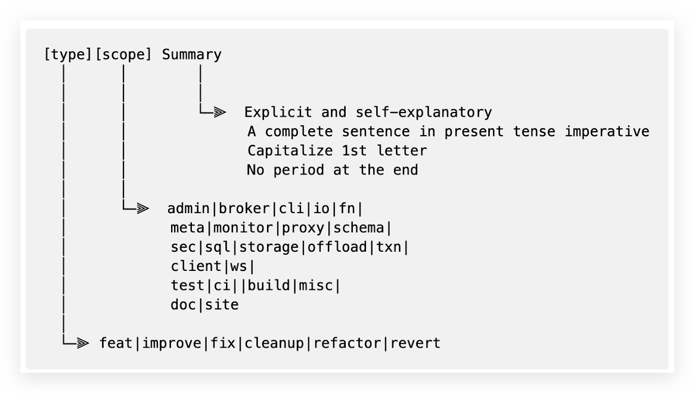

This guide explains why you need good PR titles and how you do write PR titles in Conventional Commits spec.

## Why do commit messages matter?

Since the Pulsar community uses "Squash and Merge", the commit message is effectively the same as the PR title.

Engineers and writers submit or review PRs almost every day.

A PR title is a summary of your changes.

* Vague, boring, and unclear PR titles decrease team efficiency and productivity.
* PR titles should be engaging, easy to understand, and readable.

Good titles often bring many benefits, including but not limited to the following:

* Speed up the review process.
    * You can tell from the title what changes the PR introduces.
* Facilitate understanding of PR changes.
    * PR titles are shown on Pulsar release notes as items. Concise PR titles make your changes easier to understand.
    * Especially when you read commit logs in command-line tools, clear commit messages show PR changes quickly.
* Increase search efficiency.
    * You can skim through hundreds of commits and locate desired information quickly.
* Remind you to think about your PR.
    * If you can not write a PR title in a simple way (for example, [[type]](#type), [[scope]](#scope), or [[summary]](#summary)), or you need to use several types/scopes, consider whether your PR contains **too many** changes across various scopes. If so, consider splitting this big PR into several small PRs. In this way, you might get your PRs reviewed faster.

## How to write good PR titles?

A PR title should be structured as follows:

The rule can be interpreted as: A good title = clear format ([type](#type) and [scope](#scope)) + self-explanatory [summary](#summary).

### Quick Examples  

Here are some examples of unclear and good PR titles for your quick reference. Good PR titles are concise and self-explanatory since they tell you the changes in a clear and direct way.

| Vague (Bad)                                                            | Clear (Good)                                                                                        |
|------------------------------------------------------------------------|-----------------------------------------------------------------------------------------------------|
| Producer getting producer busy is removing existing producer from list | [fix][broker] Active producers with the same name are no longer removed from the topic map          |
| Forbid to read other topic's data in managedLedger layer               | [improve][broker] Consumers are not allowed to read data on topics to which they are not subscribed |
| Fix kinesis sink backoff class not found                               | [improve][connector] xx connectors can now use the Kinesis Backoff class                            |
| K8s Function Name Length Check Allows Invalid StatefulSet              | [improve][function] Function name length cannot exceed 52 characters when using Kubernetes runtime  |

Here are steps to self-review whether the PR title is good:

1. Select a [type](#type).
2. Select a [scope](#scope).
3. Write a [summary](#summary).

For more examples with correct formats, see [Full examples](#full-examples).

### Type

`type` is "what actions do you take".

It must be one of the following.

| Type     | Label                                                                          | What actions do you take?                                         |
|----------|--------------------------------------------------------------------------------|-------------------------------------------------------------------|
| cleanup  | [type/cleanup](https://github.com/apache/pulsar/labels/type%2Fcleanup)         | Remove unused code or doc.                                        |
| improve  | [type/improvement](https://github.com/apache/pulsar/labels/type%2Fimprovement) | Submit enhancements that are neither new features nor bug fixes.  |
| feat     | [type/feature](https://github.com/apache/pulsar/labels/type%2Ffeature)         | Submit new features.                                              |
| fix      | [type/fix](https://github.com/apache/pulsar/labels/type%2Ffix)                 | Submit bug fixes.                                                 |
| refactor | [type/refactor](https://github.com/apache/pulsar/labels/type%2Frefactor)       | Restructure existing code while preserving its external behavior. |
| revert   | N/A                                                                            | Revert changes                                                    |

:::note

Choose correct labels for your PR so that your PR will automatically go to the correct chapter in release notes. If you do not specify a type label, the PR might go to the wrong place or not be included in the release notes at all.

:::

### Scope

`scope` is "where do you make changes".

Scopes evolves along with development. You can check the latest valid scopes at the [workflow file](https://github.com/apache/pulsar/blob/master/.github/workflows/ci-semantic-pull-request.yml).

### Summary

`Summary` is a single line that best sums up the changes made in the commit.

Follow the best practice below:

* Keep the summary concise and descriptive.
* Use the second person and present tense.
* Write [complete sentences](https://www.grammarly.com/blog/sentence-fragment) rather than fragments.
* Capitalize the first letter.
* Limit the length to 50 characters.

Avoid some common bad cases:

* Do not include back quotes (``).
* Do not append period at the end.
* Do not use [GitHub keywords](https://docs.github.com/en/issues/tracking-your-work-with-issues/linking-a-pull-request-to-an-issue#linking-a-pull-request-to-an-issue-using-a-keyword) followed by an issue number. This information should be provided in PR descriptions or commit messages rather than in PR titles.

:::note

If you cherry-pick changes to branches, name your PR title the same as the original PR title and label your PR with cherry-pick related labels.

:::

### Full examples

As explained in the [How to write good PR titles](#how-to-write-good-pr-titles) chapter: A good title = clear format ([type](#type) and [scope](#scope)) + self-explanatory [summary](#summary).

Here are some format examples. For self-explanatory summary examples, see [Quick examples](#quick-examples).

| Changes                        | Unclear format (Bad)                                                                        | Clear format (Good)                                                                                                         |
|--------------------------------|---------------------------------------------------------------------------------------------|-----------------------------------------------------------------------------------------------------------------------------|
| Submit breaking changes        | [Breaking change] xxx                                                                       | [feat][broker]! Support xx                                                                                                  |
| Submit PIP changes             | [PIP-198] Support xx                                                                        | [feat][broker] PIP-198: Support xx                                                                                          |
| Cherry pick changes            | [Branch-2.9] Fix xxx issue.                                                                 | [fix][broker][branch-2.9] Fix xxx issue                                                                                     |
| Revert changes                 | Revert xxx                                                                                  | [revert][broker] Revert changes about xxx                                                                                   |
| Add features                   | <li>Adding xx feature</li><li>Support delete schema forcefully</li>                         | <li>[feat][java client] Add xx feature</li><li>[feat][schema] Support xx</li>                                               |
| Fix bugs                       | [Issue 14633][pulsar-broker] Fixed xxx                                                      | [fix][broker] Fix xxx                                                                                                       |
| Submit improvements            | <li>Enhances xx</li><li>Bump netty version to 4.1.75</li>                                   | <li>[improve][sql] Improve xx performance</li><li>[improve][build] Bump Netty version to 4.1.75</li>                        |
| Update tests                   | reduce xx test flakiness                                                                    | [improve][test] Reduce xxx flaky tests                                                                                      |
| Update docs                    | <li>[Doc] add explanations for xxx</li><li>2.8.3 Release Notes</li><li>Fix typos in xx</li> | <li>[feat][doc] Add explanations for xxx</li><li>[feat][doc] Add 2.8.3 release note</li><li>[fix][doc] Fix typos in xx</li> |
| Update website                 | [Website] adjust xxx                                                                        | [improve][site] Adjust xxx                                                                                                  |
| Update instructions/guidelines | Update xxx guideline                                                                        | [improve][doc] Update xx guidelines                                                                                         |
