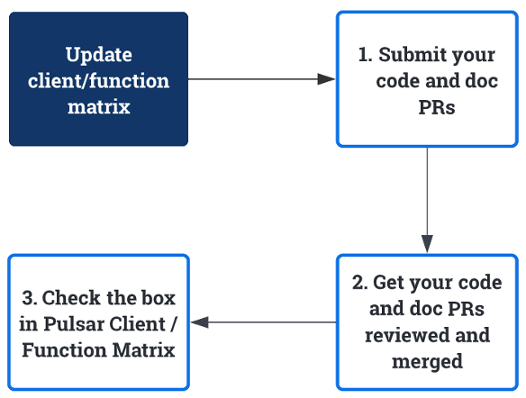

This guide explains the organization of Pulsar documentation and website repos and the workflow of updating various Pulsar documents.

## Source repositories

Currently, the source of documents and website (where the docs are finally published) are located in two repositories:

| Type          | Location                                                     | Description                                                                                                                                                                       |
|---------------|--------------------------------------------------------------|-----------------------------------------------------------------------------------------------------------------------------------------------------------------------------------|
| Documentation | [pulsar](https://github.com/apache/pulsar/tree/master/site2) | All files related to Pulsar documentation are stored in this repo.                                                                                                                |
| Website       | [pulsar-site](https://github.com/apache/pulsar-site)         | 1. All files related to the Pulsar website are stored in the **main** branch in this repo. <br/> 2. The website is built and put in in the **asf-site-next** branch in this repo. |

Documents in the `pulsar` repo are synced to the `pulsar-site` repo every 6 hours, following the rules:

| Source (pulsar)    | Destination (pulsar-site) |
|--------------------|---------------------------|
| site2/website      | site2/website-next        |
| site2/docs         | site2/website-next/docs   |

## Update versioned docs

If you want to update versioned docs, go to [site2/website/versioned_docs/ folder under the main repo](https://github.com/apache/pulsar/tree/master/site2/website/versioned_docs) to find your desired one.

For versions prior to 2.8, Pulsar releases versioned docs for each patch release. You can update the exact versioned doc.

For versions start from 2.8, Pulsar release versioned docs for each minor release. Apart from updating the content, you should take care of adding specific instructions.

For example, if you want to add docs for an improvement introduced in 2.8.2, you can add the following instructions:

```
:::note

This <fix / improvment> is available for 2.8.2 and later versions.

:::
```

:::note

Read [PIP-190: Simplify documentation release and maintenance strategy](https://github.com/apache/pulsar/issues/16637) for more information.

:::

## Update reference docs

If you want to update [Pulsar configuration docs](https://pulsar.apache.org/reference/#/latest/), pay attention to the doc source files.

- Some docs are generated from code **automatically**. If you want to update the docs, you need to update the source code files.
- Some configuration docs are updated **manually** using markdown files.

### Update configuration docs

Docs for configs of bundled components are generated from command-line tools **automatically**:

| Components | Update where ...                                                                                                                                                                                                    |
|------------|---------------------------------------------------------------------------------------------------------------------------------------------------------------------------------------------------------------------|
| Broker     | [org.apache.pulsar.broker.ServiceConfiguration](https://github.com/apache/pulsar/blob/master/pulsar-broker-common/src/main/java/org/apache/pulsar/broker/ServiceConfiguration.java)                                 |
| WebSocket  | [org.apache.pulsar.websocket.service.WebSocketProxyConfiguration](https://github.com/apache/pulsar/blob/master/pulsar-websocket/src/main/java/org/apache/pulsar/websocket/service/WebSocketProxyConfiguration.java) |
| Proxy      | [org.apache.pulsar.proxy.server.ProxyConfiguration](https://github.com/apache/pulsar/blob/master/pulsar-proxy/src/main/java/org/apache/pulsar/proxy/server/ProxyConfiguration.java)                                 |
| Standalone | [org.apache.pulsar.broker.ServiceConfiguration](https://github.com/apache/pulsar/blob/master/pulsar-broker-common/src/main/java/org/apache/pulsar/broker/ServiceConfiguration.java)                                 |
| Client     | [org.apache.pulsar.client.impl.conf.ClientConfigurationData](https://github.com/apache/pulsar/blob/master/pulsar-client/src/main/java/org/apache/pulsar/client/impl/conf/ClientConfigurationData.java)              |
| Producer   | [org.apache.pulsar.client.impl.conf.ProducerConfigurationData](https://github.com/apache/pulsar/blob/master/pulsar-client/src/main/java/org/apache/pulsar/client/impl/conf/ProducerConfigurationData.java)          |
| Consumer   | [org.apache.pulsar.client.impl.conf.ConsumerConfigurationData](https://github.com/apache/pulsar/blob/master/pulsar-client/src/main/java/org/apache/pulsar/client/impl/conf/ConsumerConfigurationData.java)          |
| Reader     | [org.apache.pulsar.client.impl.conf.ReaderConfigurationData](https://github.com/apache/pulsar/blob/master/pulsar-client/src/main/java/org/apache/pulsar/client/impl/conf/ReaderConfigurationData.java)              |

Docs for configs of external components (whose source code is hosted outside the Pulsar repositories) are updated **manually**:

| Components  | Update where ...                                                                                                                                                                 |
|-------------|----------------------------------------------------------------------------------------------------------------------------------------------------------------------------------|
| BookKeeper  | [reference-configuration-bookkeeper.md](https://github.com/apache/pulsar-site/blob/main/site2/website-next/static/reference/next/config/reference-configuration-bookkeeper.md)   |
| Log4j       | [reference-configuration-log4j.md](https://github.com/apache/pulsar-site/blob/main/site2/website-next/static/reference/next/config/reference-configuration-log4j.md)             |
| Log4j shell | [reference-configuration-log4j-shell.md](https://github.com/apache/pulsar-site/blob/main/site2/website-next/static/reference/next/config/reference-configuration-log4j-shell.md) |
| ZooKeeper   | [reference-configuration-zookeeper.md](https://github.com/apache/pulsar-site/blob/main/site2/website-next/static/reference/next/config/reference-configuration-zookeeper.md)     |

### Update command-line tool docs

Docs for bundled Java-based command-line tools are generated **automatically**:

| Components    | Update where…                                                                                                                                                                                                                                                                                             |
|---------------|-----------------------------------------------------------------------------------------------------------------------------------------------------------------------------------------------------------------------------------------------------------------------------------------------------------|
| pulsar        | Different subcommands of [bin/pulsar](https://github.com/apache/pulsar/blob/master/bin/pulsar) are updated in different code files                                                                                                                                                                        |
| pulsar-admin  | [Classes under the admin command-line folder](https://github.com/apache/pulsar/tree/master/pulsar-client-tools/src/main/java/org/apache/pulsar/admin/cli)                                                                                                                                                 |
| pulsar-client | [Classes under the client command-line folder](https://github.com/apache/pulsar/tree/master/pulsar-client-tools/src/main/java/org/apache/pulsar/client/cli)                                                                                                                                               |
| pulsar-perf   | <li>[The `websocket-producer` subcommand](https://github.com/apache/pulsar/tree/master/pulsar-testclient/src/main/java/org/apache/pulsar/proxy/socket/client)</li><li>[Other subcommands](https://github.com/apache/pulsar/tree/master/pulsar-testclient/src/main/java/org/apache/pulsar/testclient)</li> |

Docs for external command-line tools or bare scripts are updated **manually**:

| Components    | Update where…                                                                                                                               |
|---------------|---------------------------------------------------------------------------------------------------------------------------------------------|
| pulsar-shell  | [pulsar-shell.md](https://github.com/apache/pulsar-site/blob/main/site2/website-next/static/reference/next/pulsar-shell/pulsar-shell.md)    |
| pulsar-daemon | [pulsar-daemon.md](https://github.com/apache/pulsar-site/blob/main/site2/website-next/static/reference/next/pulsar-daemon/pulsar-daemon.md) |
| bookkeeper    | [bookkeeper.md](https://github.com/apache/pulsar-site/blob/main/site2/website-next/static/reference/next/bookkeeper/bookkeeper.md)          |

## Update client/function matrix

[Pulsar Feature Matrix](https://docs.google.com/spreadsheets/d/1YHYTkIXR8-Ql103u-IMI18TXLlGStK8uJjDsOOA0T20/edit#gid=1784579914) outlines every feature supported by the Pulsar client and function.

:::note

* It's public and everyone has access to edit it. You can reach out to `dev@pulsar.apache.org` if you have problems in editing.
* This matrix will be moved to the Pulsar website (instead of the spreadsheet) in the future.

:::

If you want to update the Pulsar Feature Matrix, follow the steps below.

1. Submit your code and doc PRs.
2. Get your PR reviewed and merged.
3. In the [Pulsar Feature Matrix](https://docs.google.com/spreadsheets/d/1YHYTkIXR8-Ql103u-IMI18TXLlGStK8uJjDsOOA0T20/edit#gid=1784579914), check the box in the corresponding cell with the links of PRs and doc site.


