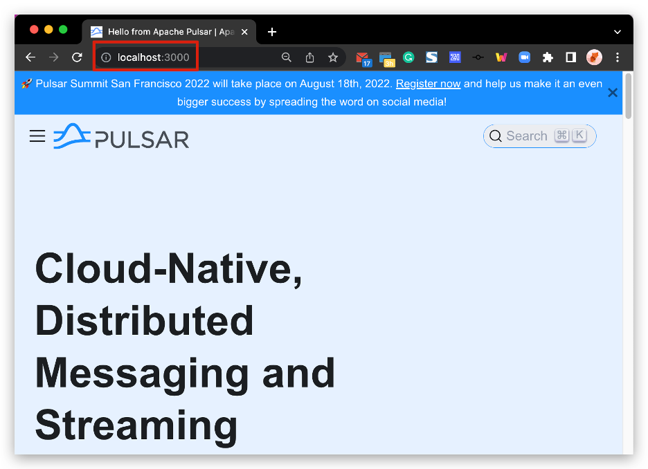

# Previewing content

This guide explains why and how to preview Pulsar content locally with detailed steps and various examples.

## Why preview changes locally?

It is **required** to preview your changes locally and attach the preview screenshots in your PR description. It brings many benefits, including but not limited to:

* You can test your writings. It's a way to check whether you use the correct [syntax](document-syntax.md). You **must ensure** docs can be compiled and published correctly.
* You can get your PR merged more quickly. Reviewers know your changes clearly and can speed up the review process.

## How to preview changes locally?

Pulsar documentation is built using [Docusaurus](https://docusaurus.io/). To preview your changes as you edit the files, you can run a local development server that serves your website and reflect the latest changes.

### Prerequisites

To verify docs are built correctly before submitting a contribution, you should set up your local environment to build and display the docs locally.

* Node >= 20.0.0 (latest LTS recommended)
* Corepack available and enabled (`corepack enable`)
* Although you can use Linux, macOS, or Windows to build locally the Pulsar documentation, macOS is the preferred build environment as it offers the most complete support for documentation building.

Installing prerequisites with [Homebrew](https://brew.sh/) on macOS or Linux:

```shell
brew install node
corepack enable
```

#### Troubleshooting Corepack installation - Homebrew installations on macOS or Linux

Sometimes Homebrew has Corepack installed, but it's not available. You might need to run `brew unlink node; brew link node; corepack enable` to fix the installation.
Please also ensure that you have upgraded Homebrew packages to the latest versions. Run `brew upgrade` to upgrade all installed packages.

Don't install `yarn` separately from a package manager since it's included with `corepack`, which is bundled with `node`. If you're using Homebrew, uninstall any existing `yarn` installation with `brew uninstall yarn` to avoid conflicts.

If `corepack enable` fails due to file conflicts, verify that no legacy `corepack` or `yarn` package is already installed. If found, remove them. Removing `corepack` on updated Homebrew installations is not recommended since it uninstalls `node`.

If issues persist, run `brew unlink node; brew link node; corepack enable`. If `corepack enable` continues to fail due to conflicting files, manually remove the conflicting files from `/opt/homebrew/bin` and try again.

### Preview changes

Pulsar website changes refer to all the changes made to the Pulsar website, including but not limited to the following pages:

* [User documents](pathname:///docs)
* [Contribution guide](about.md)
* [Release notes](pathname:///release-notes/)
* [Ecosystem page](pathname:///ecosystem)
* [Case studies](pathname:///case-studies)
* ...

Follow these steps to preview the website changes.

1. Change to the working directory:

    ```bash
    cd pulsar-site/
    ```

2. Run the following command to preview changes:

   ```bash
   # Preview changes on master (next version documentation)
   ./preview.sh

   # preview changes on a specific version
   ./preview.sh 4.0.x

   # preview changes on multiple versions
   ./preview.sh 4.0.x 3.0.x current
   ```

If you have content staleness issues, you can pass the `--clean` (or `-c`) flag to the `preview.sh` script to clean Docusaurus cache and start a fresh build.
This runs `yarn run docusaurus clear` before starting the preview server.

By default, a browser window will open at [http://localhost:3000](http://localhost:3000) to show the changes:



:::tip

When you click on `Docs`, you are taken to the latest stable version (e.g., `http://localhost:3000/docs/2.10.x/`). If you want to preview changes on `master`, change the URL to `http://localhost:3000/docs/next`

:::
### Stop preview

Switch to your command-line interface and press **Control+C**.
