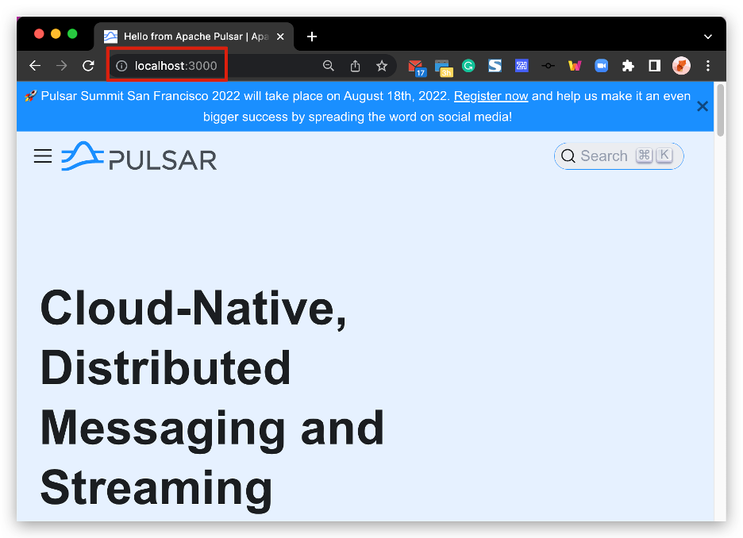

# Previewing content

This guide explains why and how to preview Pulsar content locally with detailed steps and various examples.

## Why preview changes locally?

It is **required** to preview your changes locally and attach the preview screenshots in your PR description. It brings many benefits, including but not limited to:

* You can test your writings. It's a way to check whether you use the correct [syntax](document-syntax.md). You **must ensure** docs can be compiled and published correctly.
* You can get your PR merged more quickly. Reviewers know your changes clearly and can speed up the review process.

## How to preview changes locally?

Pulsar documentation is built using [Docusaurus](https://docusaurus.io/). To preview your changes as you edit the files, you can run a local development server that serves your website and reflect the latest changes.

### Prerequisites

To verify docs are built correctly before submitting a contribution, you should set up your local environment to build and display the docs locally.

* Node v24 LTS (Node v22 LTS also works; the pinned version in `.nvmrc` and CI is v24)
* Corepack available and enabled (`corepack enable`)
* Although you can use Linux, macOS, or Windows to build locally the Pulsar documentation, macOS is the preferred build environment as it offers the most complete support for documentation building.

You can install Node.js with either **fnm** (recommended) or **Homebrew**. The repository ships a `.nvmrc` file, so fnm/nvm/asdf users will auto-select the right version.

#### Option 1: fnm (recommended)

[fnm](https://github.com/Schniz/fnm) is a fast, cross-platform Node version manager. It lets you run different Node versions per project without reinstalling, which is helpful when you contribute to multiple repositories.

```shell
# install fnm (macOS/Linux via Homebrew; see https://github.com/Schniz/fnm for other installers incl. Windows)
brew install fnm
# add shell integration; pick the line for your shell and append it to ~/.zshrc, ~/.bashrc, or ~/.config/fish/config.fish
eval "$(fnm env --use-on-cd --shell bash)"
# install Node 24 LTS, enable corepack, and switch to it in the current shell (also picked up automatically from .nvmrc on 'cd' once shell integration is active)
fnm install --corepack-enabled --use 24
fnm default 24
```

#### Option 2: Homebrew

```shell
# install Node (Homebrew's default node formula)
brew install node
# enable corepack (bundled with Node); only needs to run once per Node install
corepack enable
```

If you need to pin Node to a specific LTS line (e.g. to match CI), use fnm (Option 1) — it's easier than juggling Homebrew's versioned formulae.

#### Troubleshooting Corepack installation - Homebrew installations on macOS or Linux

After a `brew upgrade` that bumps Node, Corepack-managed `yarn`/`pnpm` symlinks in Homebrew's `bin` can become dangling and break `yarn`. Similarly, a stale standalone `yarn` package installed via Homebrew can shadow the Corepack-managed one.

To recover:

```shell
# upgrade packages so Node ships with a current Corepack
brew upgrade
# remove any stray yarn package (yarn should come from Corepack, not from Homebrew)
brew uninstall yarn 2>/dev/null || true
# delete broken symlinks in Homebrew's bin directory
find "$(brew --prefix 2>/dev/null || echo "/opt/homebrew")/bin" -type l ! -exec test -e {} \; -delete
# enable corepack; if the command fails, remove the conflicting files from the Homebrew bin directory and try again
corepack enable
```

Don't install `yarn` separately from a package manager since it's included with Corepack, which is bundled with Node. If you're using Homebrew, uninstall any existing `yarn` installation with `brew uninstall yarn` to avoid conflicts.

If `corepack enable` continues to fail due to conflicting files, manually remove the conflicting files from the Homebrew bin directory (shown by `brew --prefix`) and try again.

### Preview changes

Pulsar website changes refer to all the changes made to the Pulsar website, including but not limited to the following pages:

* [User documents](pathname:///docs)
* [Contribution guide](about.md)
* [Release notes](pathname:///release-notes/)
* [Ecosystem page](pathname:///ecosystem)
* [Case studies](pathname:///case-studies)
* ...

Follow these steps to preview the website changes.

1. Change to the working directory:

    ```bash
    cd pulsar-site/
    ```

2. Run the following command to preview changes:

   ```bash
   # Preview changes on master (next version documentation)
   ./preview.sh

   # preview changes on a specific version
   ./preview.sh 4.0.x

   # preview changes on multiple versions
   ./preview.sh 4.0.x 3.0.x current
   ```

If you have content staleness issues, you can pass the `--clean` (or `-c`) flag to the `preview.sh` script to clean Docusaurus cache and start a fresh build.
This runs `yarn run docusaurus clear` before starting the preview server.

By default, a browser window will open at [http://localhost:3000](http://localhost:3000) to show the changes:



:::tip

When you click on `Docs`, you are taken to the latest stable version (e.g., `http://localhost:3000/docs/2.10.x/`). If you want to preview changes on `master`, change the URL to `http://localhost:3000/docs/next`

:::
### Stop preview

Switch to your command-line interface and press **Control+C**.
