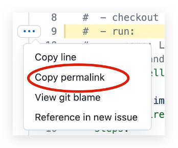

````mdx-code-block
import Tabs from '@theme/Tabs';
import TabItem from '@theme/TabItem';
````

This guide explains how to write Pulsar documentation using the MDX-compatible Markdown syntax.

## Background

The Pulsar documentation uses [Markdown](https://www.markdownguide.org/basic-syntax/) as its markup language and [Docusaurus](https://docusaurus.io/) for generating the documentation and website, with [MDX](https://mdxjs.com/) enhancement.

### Why use new Markdown syntax?

The new Pulsar website is upgraded to Docusaurus V2, which uses MDX as the parsing engine. MDX can do much more than just parsing standard Markdown syntax, like rendering React components inside your documents as well.

### How to test doc changes?

You can play with the MDX format in the [MDX Playground](https://mdxjs.com/playground/). Write some MDX to find out what it turns into. You can see the rendered result, the generated code, and the intermediary ASTs. This can be helpful for debugging or exploring.

For how to test doc changes locally, read the [Content Preview Guide](document-preview.md).

## Syntax

This guide just highlights a few selected important rules and frequently used syntax. For the complete syntax guide, read the [Markdown Features](https://docusaurus.io/docs/markdown-features) document from Docusaurus and [Markdown](https://mdxjs.com/docs/what-is-mdx/#markdown) document from MDX.

### Markdown

* Use Markdown rather than HTML as much as possible, or else MDX may not recognize it. For example, when constructing complex tables, do not use `<table>`.
* Use closing tags. `<li><li/>` and `<br/>` are especially useful for constructing complex tables, such as creating a list and adding a blank line.

#### Example 1

```markdown
| Directory | Contains                            |
|:----------|:------------------------------------|
| **Hello** | <li>a</li><li>b</li><br/><li>c</li> |
```

| Directory | Contains                            |
|:----------|:------------------------------------|
| **Hello** | <li>a</li><li>b</li><br/><li>c</li> |

#### Example 2

```markdown
| a   | b   | c                        |
|-----|-----|--------------------------|
| aa  | bb  | cc1<br/>cc2<br/><br/>cc3 |
```

| a   | b   | c                        |
|-----|-----|--------------------------|
| aa  | bb  | cc1<br/>cc2<br/><br/>cc3 |

### Tab

Before using multiple tabs, add these imports at the beginning of the file:

`````markdown
````mdx-code-block
import Tabs from '@theme/Tabs';
import TabItem from '@theme/TabItem'; 
````
`````

Then, you can write tabs as:

```markdown
<Tabs>
  <TabItem value="apple" label="Apple" default>
    This is an apple 🍎
  </TabItem>
  <TabItem value="orange" label="Orange">
    This is an orange 🍊
  </TabItem>
  <TabItem value="banana" label="Banana">
    This is a banana 🍌
  </TabItem>
</Tabs>
```

<Tabs>
  <TabItem value="apple" label="Apple" default>
    This is an apple 🍎
  </TabItem>
  <TabItem value="orange" label="Orange">
    This is an orange 🍊
  </TabItem>
  <TabItem value="banana" label="Banana">
    This is a banana 🍌
  </TabItem>
</Tabs>

Read more about how to write multiple tabs at [Tabs](https://docusaurus.io/docs/markdown-features/tabs).

### Code blocks

Read more about how to use syntax highlighting and supported languages at [Syntax highlighting](https://docusaurus.io/docs/markdown-features/code-blocks#syntax-highlighting).

### Admonitions

Docusaurus supports these admonitions:

```markdown
:::note

Some **content** with _Markdown_ `syntax`.

:::

:::tip

Some **content** with _Markdown_ `syntax`.

:::

:::info

Some **content** with _Markdown_ `syntax`.

:::

:::caution

Some **content** with _Markdown_ `syntax`.

:::

:::danger

Some **content** with _Markdown_ `syntax`.

:::
```

:::note

Some **content** with _Markdown_ `syntax`.

:::

:::tip

Some **content** with _Markdown_ `syntax`.

:::

:::info

Some **content** with _Markdown_ `syntax`.

:::

:::caution

Some **content** with _Markdown_ `syntax`.

:::

:::danger

Some **content** with _Markdown_ `syntax`.

:::

Read more about how to write admonitions at [Admonitions](https://docusaurus.io/docs/markdown-features/admonitions).

### Assets

Static assets are hosted under `/assets` for all documentations:

```markdown

```

### Indentation and space

* Use the same indentation for running texts and code blocks.
* For the content block after an **ordered list**, indent the content block by only 3 spaces (not 4 spaces).
* For the content block after an **unordered list**, indent the content block by only 2 spaces.
* Insert **exact one** empty line (not two empty lines or more) between code blocks and running texts.

:::caution

If you don't insert the empty line, the text cannot be rendered properly. You should encounter an error by [preview](document-preview.md). 

:::

### Metadata

If you create a new `.md` file, add quotes for the value of `sidebar_label`.

```yaml
---
id: admin-api-partitioned-topics
title: Managing partitioned topic
sidebar_label: "Partitioned topics"
---
```

If you don't set the `sidebar_label` property, the label is default to `title`.

### Tables

To help tables be easier to maintain, consider adding additional spaces to the column widths to make them consistent. For examples:

```
| App name | Description         | Requirements   |
| :------- | :------------------ | :------------- |
| App 1    | Description text 1. | Requirements 1 |
| App 2    | Description text 2. | None           |
```

To format tables easily, you can install a plugin or extension in your editor as below:

* Visual Studio Code: [Markdown Table Prettifier](https://marketplace.visualstudio.com/items?itemName=darkriszty.markdown-table-prettify)
* Sublime Text: [Markdown Table Formatter](https://packagecontrol.io/packages/Markdown%20Table%20Formatter)
*  Atom: [Markdown Table Formatter](https://atom.io/packages/markdown-table-formatter)

### Links

Use links instead of summarizing to help preserve a single source of truth in Pulsar documentation.

#### Anchor links

Headings generate anchor links when rendered. For example:

`## This is an example` generates the anchor `#this-is-an-example`.


:::caution

* Avoid cross-reference docs to headings unless you need to link to a specific section of the document. This avoids breaking anchors in the future in case the heading is changed.
* If possible, avoid changing headings, because they're not only linked internally. There are various links to Pulsar documentation on the Internet, such as tutorials, presentations, StackOverflow posts, and other sources.

:::

#### Links to internal documentation

Internal refers to documentation in the same Pulsar project.

General rules:

* Use relative links rather than absolute URLs.
* Do not prepend `./` or `../../` to links to files or directories.

Examples:

| Scenario                                                                         | Good                                                                            | Bad                                                                                                                                                                                                 |
|----------------------------------------------------------------------------------|---------------------------------------------------------------------------------|-----------------------------------------------------------------------------------------------------------------------------------------------------------------------------------------------------|
| Cross-reference to other markdown file (/path/xx/ is not needed)                 | `[Function overview](function-overview.md)`                                     | <li>`[Function overview](functions-overview)`</li><li>`[Function overview](https://pulsar.apache.org/docs/next/functions-overview/)`</li><li>`[Function overview](../../function-overview.md)`</li> |
| Cross-reference to other chapters in the same markdown file (# and - are needed) | `[Install builtin connectors (optional)](#install-builtin-connectors-optional)` | N/A                                                                                                                                                                                                 |

Read more about how to write Markdown links at [Markdown links](https://docusaurus.io/docs/markdown-features/links).

#### Links to external documentation

When describing interactions with external software, it's often helpful to include links to external documentation. When possible, make sure that you're linking to an [authoritative source](#authoritative-sources).

For example, if you're describing a feature in Microsoft's Active Directory, include a link to the official Microsoft documentation.

#### Link to a specific line of code

Use a **permalink** when linking to a specific line in a file to ensure users land on the line you're referring to though lines of code change over time.



### Authoritative sources

When citing external information, use sources that are written by the people who created the item or product in question. These sources are the most likely to be accurate and remain up to date.

* ✅ Authoritative sources include the following:
  * Official documentation for a product.
  
    For example, if you're setting up an interface with the Google OAuth 2 authorization server, include a link to Google's documentation.

  * Official documentation for a project.
  
    For example, if you're citing NodeJS functionality, refer directly to [NodeJS documentation](https://nodejs.org/en/docs/).

  * Books from an authoritative publisher.

* ❌ Authoritative sources do not include the following:
  * Personal blog posts.
  * Documentation from a company that describes another company's product.
  * Non-trustworthy articles.
  * Discussions on forums such as Stack Overflow.

While many of these sources to avoid can help you learn skills and or features, they can become obsolete quickly. Nobody is obliged to maintain any of these sites. Therefore, you should avoid using them as reference literature.

Non-authoritative sources are acceptable only if there is no equivalent authoritative source. Even then, focus on non-authoritative sources that are extensively cited or peer-reviewed.

### Escape

Escape `<` and `>` with back-quote or HTML escape characters.

### Headings

* Each documentation page begins with a **level 2** heading (`##`). This becomes the `<h1>` element when the page is rendered to HTML.
* Do not skip a level.
* Leave one blank line before and after the heading.
* Do not use links as part of heading text.
* When you change the heading text, the anchor link changes. To avoid broken links:
    * Do not use step numbers in headings.
    * When possible, do not use words that might change in the future.
