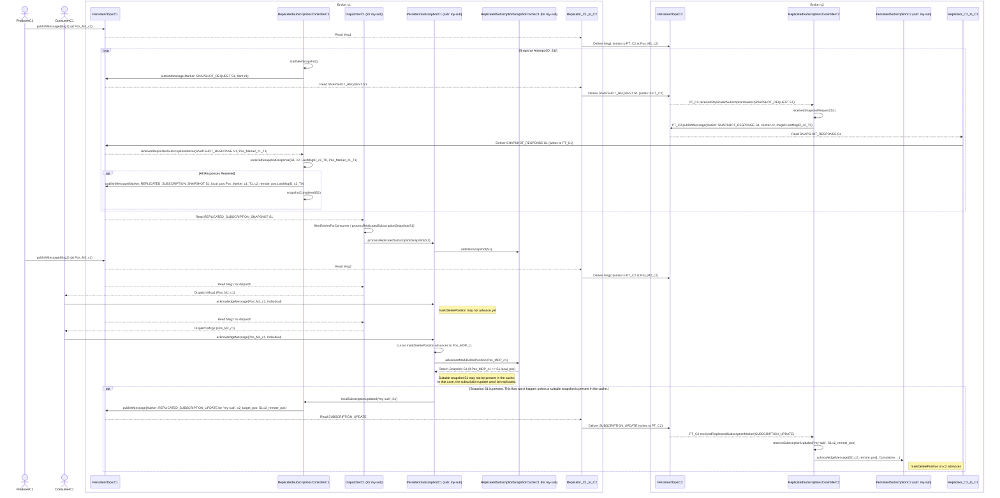

````mdx-code-block
import Tabs from '@theme/Tabs';
import TabItem from '@theme/TabItem';
````

## Enable geo-replication for a namespace

You must enable geo-replication on a [per-tenant basis](#concepts-multi-tenancy) in Pulsar. For example, you can enable geo-replication between two specific clusters only when a tenant has access to both clusters.

Geo-replication is managed at the namespace level, which means you only need to create and configure a namespace to replicate messages between two or more provisioned clusters that a tenant can access.

Complete the following tasks to enable geo-replication for a namespace:

* [Enable a geo-replication namespace](#enable-geo-replication-at-namespace-level)
* [Configure that namespace to replicate across two or more provisioned clusters](admin-api-namespaces.md#configure-replication-clusters)

### Configuration store and geo-replication setup

Geo-replication setup — including cluster registrations, tenants, namespaces, partitioned topic metadata, and their policies — is stored in the [configuration store](concepts-architecture-overview.md#configuration-store). Individual topic partitions and non-partitioned topics are not part of the configuration store; they are local to each cluster and tracked in the cluster's [metadata store](concepts-architecture-overview.md#metadata-store). A shared configuration store is not required for geo-replication.

There are three approaches for managing the configuration store in a geo-replicated setup:

#### Independent configuration stores (default)

By default, each Pulsar cluster uses its [metadata store](concepts-architecture-overview.md#metadata-store) as the [configuration store](concepts-architecture-overview.md#configuration-store) as well, so each cluster independently manages its own cluster registrations, tenants, namespaces, partitioned topic metadata, and their policies. To set up geo-replication, all participating clusters must be registered in each other and the tenant and namespace must be created with matching replication policies on every cluster.

#### Shared configuration store

Clusters can share a dedicated [configuration store](concepts-architecture-overview.md#configuration-store) that is separate from each cluster's local metadata store. A shared configuration store is typically deployed across multiple regions or zones for fault tolerance. All clusters that use it share the same cluster registrations, tenants, namespaces, partitioned topic metadata, and their policies, so any change made on one cluster is immediately visible to all others.

#### Configuration synchronization via `configurationMetadataSyncEventTopic`

When independent configuration stores are used on each cluster, configuration store metadata can still be synchronized across clusters using the `configurationMetadataSyncEventTopic` setting. To bootstrap this setup, each participating cluster must be independently configured with its own cluster registration, plus a dedicated tenant and namespace to hold the sync topic. Once geo-replication is active for that namespace, configuration store metadata — including subsequent cluster registrations, tenants, namespaces, and their policies — is automatically synchronized across all participating clusters via that topic.

#### Topic policies

Topic policies are shared via geo-replication when the namespace has geo-replication enabled, regardless of which of the configuration store approaches is used. Both local (single-cluster) and global (all-clusters) policies are supported. Global topic policies apply to all clusters unless it has been overridden with a local topic policy in a specific cluster. Topic policies require `topicLevelPoliciesEnabled=true` in broker configuration (enabled by default).

#### Creation of topics in geo-replication

For **non-partitioned topics**, topic auto-creation must be enabled at the broker level (the default) or in the namespace policy, or the topic must be created explicitly in each cluster.

For **partitioned topics**, note that partitioned topic metadata (the topic name and partition count) is stored in the configuration store, while the individual topic partitions themselves are local to each cluster. When `createTopicToRemoteClusterForReplication=true` (the default), it is sufficient to create the topic in a single cluster — Pulsar automatically creates the matching partitioned topic metadata in remote clusters. Despite its name, this setting applies only to partitioned topics. If `createTopicToRemoteClusterForReplication` is disabled and clusters do not share a configuration store, partitioned topics must be created explicitly in each cluster. In that case, partitioned topic metadata must exist on all clusters before any clients connect. If it is missing, a consumer may auto-create a non-partitioned topic on the cluster lacking the metadata, resulting in incompatible topic types across clusters. Additionally, replication may create individual topic partitions on the target cluster without the corresponding partitioned topic metadata, leaving those partitions orphaned. For this reason, keeping `createTopicToRemoteClusterForReplication` enabled is recommended.

#### Cascading topic deletions

The configuration approach also determines how changes to the replication clusters configuration propagate between clusters. In particular, certain configuration changes can trigger automatic topic deletions on remote clusters. See [Cascading topic deletions when modifying the replication clusters configuration](#cascading-topic-deletions-when-modifying-the-replication-clusters-configuration) for details.

### Replication configuration settings

The target clusters for replication of a message are determined by a hierarchy of settings at the tenant, namespace, topic, and message level:

* **Tenant `allowed-clusters`**: Specifies which clusters the tenant is permitted to use for replication. An empty value means all clusters are allowed. Note that this setting cannot be modified once the tenant has existing namespaces, so it must be configured before creating any namespaces under the tenant.

* **Namespace `clusters`**: Defines the default set of clusters that messages in the namespace are replicated to.

* **Namespace `allowed-clusters`**: Further restricts which clusters are permitted for replication at the namespace level, overriding the tenant-level setting. Introduced in [PIP-321](https://github.com/apache/pulsar/blob/master/pip/pip-321.md).

* **Topic-level policies**: Can override the namespace-level `clusters` setting for a specific topic. Topic policies can be **local** (applying only to the local cluster) or **global** (replicated to all clusters in the geo-replication set, see [PIP-92](https://github.com/apache/pulsar/blob/master/pip/pip-92.md)). Note that `allowed-clusters` has not been implemented at the topic level; [PIP-321](https://github.com/apache/pulsar/blob/master/pip/pip-321.md) mentions that it could be added in the future.

* **Message-level replication control**: Producers can override which clusters a specific message is replicated to using the [`replicationClusters`](/api/client/4.1.x/org/apache/pulsar/client/api/TypedMessageBuilder.html#replicationClusters(java.util.List)) method in the client API, or disable replication entirely for a message using [`disableReplication`](/api/client/4.1.x/org/apache/pulsar/client/api/TypedMessageBuilder.html#disableReplication()) (see [Selective replication](#selective-replication)). Note that these settings cannot override the `allowed-clusters` configuration — messages can only be routed to clusters that are permitted by the resolved `allowed-clusters` settings.

The `clusters` and `allowed-clusters` settings are resolved hierarchically. When the tenant-level `allowed-clusters` is non-empty, all clusters specified in namespace-level `allowed-clusters` must be a subset of it — this is validated when `allowed-clusters` is modified at the namespace level. Namespace-level `allowed-clusters` can further restrict the tenant-level configuration, and topic-level policies can override the namespace-level `clusters` setting for a specific topic.

### 1-way (unidirectional) and 2-way (bidirectional) geo-replication

Geo-replication can be configured as 1-way (unidirectional) or 2-way (bidirectional). The available options depend on whether a shared configuration store is used.

#### Replication direction with a shared configuration store

When a shared configuration store is used, namespace configuration is shared across all clusters, so geo-replication is always 2-way at the namespace level. Individual topics can be made unidirectional by adding a local topic-level `clusters` policy on a specific cluster that includes only the local cluster. This prevents messages produced on that cluster from being replicated to others. However, since topic policies do not include `allowed-clusters`, producers can still override this using the message-level `replicationClusters` setting, so true enforcement of 1-way replication is not possible with a shared configuration store.

#### Replication direction with separate metadata stores

When each cluster uses its own metadata store, 1-way or 2-way replication is determined by the namespace `clusters` and `allowed-clusters` settings on each cluster:

* **2-way replication**: Both clusters include each other in their namespace `clusters` and `allowed-clusters` settings, so messages flow in both directions.

* **1-way replication**: On the cluster that should not replicate outbound, set both `clusters` and `allowed-clusters` to include only the local cluster. The remote cluster can still replicate inbound to this cluster if it is configured to do so.
  * **`allowed-clusters`**: Forcefully prevents replication to any cluster not listed. This cannot be overridden by producers using the message-level `replicationClusters` setting.
  * **`clusters`**: Sets the default replication targets. If only the local cluster is listed, outbound replication is disabled by default, though producers can still override this per-message using `replicationClusters` unless `allowed-clusters` also restricts it.

:::note
The [replicated subscription](#replicated-subscriptions) feature requires 2-way geo-replication and is not available when geo-replication is configured as 1-way.
:::

## Local persistence and forwarding

When messages are produced on a Pulsar topic, messages are first persisted in the local cluster, and then forwarded asynchronously to the remote clusters.

In normal cases, when connectivity issues are none, messages are replicated immediately, at the same time as they are dispatched to local consumers. Typically, the network [round-trip time](https://en.wikipedia.org/wiki/Round-trip_delay_time) (RTT) between the remote regions defines end-to-end delivery latency.

Applications can create producers and consumers in any of the clusters, even when the remote clusters are not reachable (like during a network partition).

Producers and consumers can publish messages to and consume messages from any cluster in a Pulsar instance. However, subscriptions cannot only be local to the cluster where the subscriptions are created but also can be transferred between clusters after the replicated subscription is enabled. Once the replicated subscription is enabled, you can keep the subscription state in synchronization. Therefore, a topic can be asynchronously replicated across multiple geographical regions. In case of failover, a consumer can restart consuming messages from the failure point in a different cluster.


In the aforementioned example, the **T1** topic is replicated among three clusters, **Cluster-A**, **Cluster-B**, and **Cluster-C**.

All messages produced in any of the three clusters are delivered to all subscriptions in other clusters. In this case, **C1** and **C2** consumers receive all messages that **P1**, **P2**, and **P3** producers publish. Ordering is still guaranteed on a per-producer basis.

## Configure replication

To configure geo-replicated clusters, complete the following steps.

### Step 1: Connect replication clusters

To replicate data among clusters, you need to configure each cluster to connect to the other. You can use the [`pulsar-admin`](pathname:///reference/#/@pulsar:version_reference@/pulsar-admin/) tool to create a connection.

**Example**

Suppose that you have 3 replication clusters: `us-west`, `us-cent`, and `us-east`.

1. Configure the connection from `us-west` to `us-east`.

   Run the following command on `us-west`.

   ```shell
   bin/pulsar-admin clusters create \
   --broker-url pulsar://<DNS-OF-US-EAST>:<PORT> \
   --url http://<DNS-OF-US-EAST>:<PORT> \
   us-east
   ```

:::tip

   - If you want to use a secure connection for a cluster, you can use the flags `--broker-url-secure` and `--url-secure`. For more information, see [pulsar-admin clusters create](pathname:///reference/#/@pulsar:version_reference@/pulsar-admin/clusters?id=create).
   - Different clusters may have different authentications. You can use the authentication flag `--auth-plugin` and `--auth-parameters` together to set cluster authentication, which overrides `brokerClientAuthenticationPlugin` and `brokerClientAuthenticationParameters` if `authenticationEnabled` sets to `true` in `broker.conf` and `standalone.conf`. For more information, see [authentication and authorization](concepts-authentication.md).

:::

2. Configure the connection from `us-west` to `us-cent`.

   Run the following command on `us-west`.

   ```shell
   bin/pulsar-admin clusters create \
   --broker-url pulsar://<DNS-OF-US-CENT>:<PORT>	\
   --url http://<DNS-OF-US-CENT>:<PORT> \
   us-cent
   ```

3. Run similar commands on `us-east` and `us-cent` to create connections among clusters.

### Step 2: Grant permissions to properties

To replicate to a cluster, the tenant needs permission to use that cluster. You can grant permission to the tenant when you create the tenant or grant it later.

Specify all the intended clusters when you create a tenant:

```shell
bin/pulsar-admin tenants create my-tenant \
--admin-roles my-admin-role \
--allowed-clusters us-west,us-east,us-cent
```

To update permissions of an existing tenant, use `update` instead of `create`.

### Step 3: Enable geo-replication

You can enable geo-replication at **namespace** or **topic** level.

#### Enable geo-replication at namespace level

You can create a namespace with the following command sample.

```shell
bin/pulsar-admin namespaces create my-tenant/my-namespace
```

Initially, the namespace is not assigned to any cluster. You can assign the namespace to clusters using the `set-clusters` subcommand:

```shell
bin/pulsar-admin namespaces set-clusters my-tenant/my-namespace \
--clusters us-west,us-east,us-cent
```

#### Enable geo-replication at topic level

You can set geo-replication at topic level using the command `pulsar-admin topics set-replication-clusters`. For the latest and complete information about `Pulsar admin`, including commands, flags, descriptions, and more information, see [Pulsar admin docs](pathname:///reference/#/@pulsar:version_reference@/pulsar-admin/).

```shell
bin/pulsar-admin topics set-replication-clusters --clusters us-west,us-east,us-cent my-tenant/my-namespace/my-topic
```

:::tip

- You can change the replication clusters for a namespace at any time, without disruption to ongoing traffic. Replication channels are immediately set up or stopped in all clusters as soon as the configuration changes.
- Once you create a geo-replication namespace, any topics that producers or consumers create within that namespace are replicated across clusters. Typically, each application uses the `serviceUrl` for the local cluster.
- If you are using Pulsar version `2.10.x`, to enable geo-replication at topic level, you need to change the following configurations in the `conf/broker.conf` or `conf/standalone.conf` file to enable topic policies service.

```conf
systemTopicEnabled=true
topicLevelPoliciesEnabled=true
```

:::

### Step 4: Use topics with geo-replication

#### Selective replication

By default, messages are replicated to all clusters configured for the namespace. You can restrict replication selectively by specifying a replication list for a message, and then that message is replicated only to the subset in the replication list.

The following is an example of the [Java API](client-libraries-java.md). Note the use of the `replicationClusters` method when you construct the [Message](/api/client/org/apache/pulsar/client/api/Message) object:

```java
List<String> restrictReplicationTo = Arrays.asList(
        "us-west",
        "us-east"
);

Producer producer = client.newProducer()
        .topic("some-topic")
        .create();

producer.newMessage()
        .value("my-payload".getBytes())
        .replicationClusters(restrictReplicationTo)
        .send();
```

#### Topic stats

You can check topic-specific statistics for geo-replication topics using one of the following methods.

````mdx-code-block
<Tabs groupId="api-choice"
  defaultValue="pulsar-admin"
  values={[{"label":"pulsar-admin","value":"pulsar-admin"},{"label":"REST API","value":"REST API"}]}>
<TabItem value="pulsar-admin">

Use the [`pulsar-admin topics stats`](pathname:///reference/#/@pulsar:version_reference@/pulsar-admin/topics?id=stats) command.

```shell
bin/pulsar-admin topics stats persistent://my-tenant/my-namespace/my-topic
```

</TabItem>
<TabItem value="REST API">

[](swagger:/admin/v2/PersistentTopics_getStats)

</TabItem>

</Tabs>
````

Each cluster reports its own local stats, including the incoming and outgoing replication rates and backlogs.

#### Geo-replication topic deletion

**Explicit topic deletion**

The recommended procedure for deleting a geo-replication topic from all clusters is:

1. Ensure there are no active producers or consumers on the topic across all clusters before proceeding. If any are present when the next step is performed, the topic will be forcefully deleted from under them. If auto-topic creation is also enabled, the topic may be immediately recreated.
2. Set a global topic-level `clusters` policy to include only the local cluster. This triggers the cascading deletion mechanism to remove the topic (including topic partitions in the case of a partitioned topic) and clean up schemas and local topic policies on all excluded clusters. Producers and consumers connected to an excluded cluster will be rejected from reconnecting. See [Cascading topic deletions when modifying the replication clusters configuration](#cascading-topic-deletions-when-modifying-the-replication-clusters-configuration) for details.
3. Delete the topic. Geo-replication is now disabled, so the deletion only affects the local cluster.
4. Run `pulsar-admin topicPolicies delete <topic>` on each cluster to remove the remaining topic-level policy state. If active producers or consumers are still present at this point, the topic may be recreated and geo-replication re-enabled, which is why step 1 is a prerequisite.

Without this procedure, forcefully deleting a topic on one cluster leaves it orphaned — it still exists on peer clusters and geo-replication from those clusters remains active. If auto-topic creation is enabled on the cluster where the topic was deleted, the topic may be recreated through auto-creation or because `createTopicToRemoteClusterForReplication=true` is set on a peer cluster.

When namespace or topic configuration is shared via a shared configuration store or synchronized via `configurationMetadataSyncEventTopic`, forcefully deleting a topic propagates the deletion to all clusters that share or receive the configuration. However, replication delays may cause the topic to be recreated before the deletion takes effect everywhere. For this reason, it is recommended to follow the procedure above.

To remove a topic from a specific cluster only, set a global topic-level `clusters` policy that excludes that cluster. The broker automatically deletes the topic (including topic partitions in the case of a partitioned topic) on the excluded cluster. Do not remove the global topic-level policy afterward, as this would allow the namespace-level `clusters` policy to take effect and potentially re-enable replication. To later delete the topic from all clusters, follow the full procedure above.

To retain the topic in a specific cluster while removing it from all others, follow the procedure above on the cluster where the topic should be retained, but omit steps 3 and 4.

**Deletion by garbage collection**

A geo-replication topic is also automatically deleted by garbage collection when `brokerDeleteInactiveTopicsEnabled=true` and no producers or consumers are connected to it. The additional conditions depend on the `brokerDeleteInactiveTopicsMode` setting:

- `delete_when_no_subscriptions`: the topic is deleted when there are no subscriptions.
- `delete_when_subscriptions_caught_up`: the topic is deleted when all subscriptions have caught up and there is no backlog.

The `brokerDeleteInactiveTopicsMode` setting can be overridden at the namespace level with the `inactive-topic-policies`.

Each region independently decides when it is safe to delete the topic locally. To trigger garbage collection, close all producers and consumers on the topic and delete all local subscriptions in every replication cluster. When Pulsar determines that no valid subscription remains across the system, it garbage collects the topic.

## Cascading topic deletions when modifying the replication clusters configuration

:::warning

Modifying the `clusters` configuration at the namespace or topic policy level can automatically trigger topic deletions on excluded clusters. Always maintain independent backups if protection against accidental deletions is a requirement.

:::

### Namespace-level deletions

When namespace configuration is shared or synchronized across clusters (via a shared configuration store or `configurationMetadataSyncEventTopic`, see [Configuration store and geo-replication setup](#configuration-store-and-geo-replication-setup)), removing a cluster from the namespace `clusters` configuration automatically deletes all topics in that namespace on the excluded cluster. When namespace configuration is not shared or synchronized, namespace-level policy changes remain local and do not trigger cascading deletions on remote clusters.

If the namespace-level `allowed-clusters` is modified to exclude a cluster, topics on that cluster are also deleted regardless of any topic-level `clusters` policy, since `clusters` must be a subset of `allowed-clusters`.

### Topic-level deletions

Since topic policies are always shared via geo-replication when the namespace has geo-replication enabled (see [Topic policies](#topic-policies)), updating a global topic-level `clusters` policy to exclude a cluster deletes that topic and all its partitions on the excluded cluster, regardless of whether namespace configuration is shared or synchronized. Schemas and local topic policies are cleaned up after the last topic partition is deleted. Topic-level policy updates follow the replication direction of the namespace — with 1-way replication, updates flow only toward the destination cluster.

### Retaining specific topics

To prevent a specific topic from being deleted when the namespace `clusters` configuration changes, set a global topic-level `clusters` policy for that topic listing the clusters where it should be retained. This overrides the namespace-level `clusters` policy for that topic. Since it is not currently possible to override the namespace-level `allowed-clusters` in a topic policy, this protection does not apply if `allowed-clusters` is also changed to exclude a cluster.

There is no single configuration that protects all topics in a namespace — the policy must be applied to each topic individually. For additional protection against the global topic-level policy itself being modified to exclude a cluster, a local topic-level `clusters` policy can also be set on that cluster to include only the local cluster.

Geo-replication is designed for high availability and disaster recovery, not as a substitute for backups. A misconfigured `clusters` policy can trigger cascading topic deletions on peer clusters.

## Replicated subscriptions

Pulsar supports replicated subscriptions, so you can keep the subscription state in sync, within a sub-second timeframe, in the context of a topic that is being asynchronously replicated across multiple geographical regions.

In case of failover, a consumer can restart consuming from the failure point in a different cluster.

### Enable replicated subscription

:::note

Replicated subscriptions require [2-way geo-replication](#1-way-and-2-way-geo-replication) to be properly configured between all participating clusters. See [1-way and 2-way geo-replication](#1-way-and-2-way-geo-replication) for configuration requirements.

:::

If you want to use replicated subscriptions in Pulsar:

* For broker side: set `enableReplicatedSubscriptions` to `true` in [`broker.conf`](https://github.com/apache/pulsar/blob/470b674016c8718f2dfd0a0f93cf02d49af0fead/conf/broker.conf#L592).

* For consumer side: replicated subscription is disabled by default. You can enable replicated subscriptions when creating a consumer.

  ```java
  Consumer<String> consumer = client.newConsumer(Schema.STRING)
              .topic("my-topic")
              .subscriptionName("my-subscription")
              .replicateSubscriptionState(true)
              .subscribe();
  ```

### Advantages

The advantages of replicated subscription are as follows.

 * It is easy to implement the logic.
 * You can choose to enable or disable replicated subscription.
 * When you enable it, the overhead is low, and it is easy to configure.
 * When you disable it, the overhead is zero.

### Limitations

The limitations of replicated subscription are as follows.

* Replicated subscriptions use periodic snapshots to establish a consistent association between message positions across clusters. Snapshots are taken every `replicatedSubscriptionsSnapshotFrequencyMillis` milliseconds (default: 1000 ms), but the effective granularity of mark-delete position updates on the remote cluster depends on how many messages are produced between snapshots. See [Replicated subscriptions snapshot configuration and tuning](#replicated-subscriptions-snapshot-configuration-and-tuning) for details.
* Only the mark-delete position (the baseline cursor position) is replicated — individual acknowledgments are not. Messages acknowledged out of order may be redelivered after a cluster failover.
* Replicated subscriptions do not provide consistent behavior when consumers are active on multiple clusters simultaneously. Most messages will be processed on both clusters (duplicate processing), and some may be processed on either cluster depending on replication timing. To avoid this, process messages on a single cluster at a time when using replicated subscriptions.
* Delayed message delivery impairs subscription replication. The mark-delete position does not advance until delayed messages have been delivered and acknowledged, so replication lags behind accordingly.

:::note

* A [snapshot attempt](https://github.com/apache/pulsar/blob/master/pip/pip-33.md#constructing-a-cursor-snapshot) is initiated every `replicatedSubscriptionsSnapshotFrequencyMillis` when new messages have been produced since the last attempt. Each attempt writes several marker messages to the topic — the snapshot request, the response from the remote cluster (replicated back), and the final snapshot marker. These markers increase the backlog for inactive subscriptions on both clusters.

:::

### Replicated subscriptions snapshot configuration and tuning

Replicated subscriptions use a periodic snapshotting mechanism to establish a consistent association between message positions across clusters. The design is described in [PIP-33: Replicated subscriptions](https://github.com/apache/pulsar/blob/master/pip/pip-33.md#constructing-a-cursor-snapshot).

Each snapshot attempt consists of one or two rounds, where each round is a snapshot request sent to all remote clusters followed by their responses. With two clusters, one round is sufficient; with more than two clusters, two rounds are required. When all rounds complete successfully, the final snapshot — containing the consistent cross-cluster position mapping — is written to the topic. Two-round attempts take roughly twice as long to complete, making snapshot timeout tuning particularly important in that case. If any participating cluster is offline, snapshot attempts will not be started and no snapshots will be created. As a result, mark-delete position updates cannot be propagated for any messages accumulated during the offline period, even after connectivity is restored, since those messages have no associated snapshots.

The effective granularity of mark-delete position updates on the remote cluster is determined by how many messages are written between consecutive snapshots, not by `replicatedSubscriptionsSnapshotFrequencyMillis` alone. A snapshot is only written to the topic once the full round-trip completes: the remote replicator must process all incoming messages up to the point where it receives the snapshot request, write a response, and have that response replicated back and processed on the originating cluster. With more than two clusters, two rounds of snapshotting are required, doubling the round-trip time. With bursty or high-rate message production, many messages can accumulate during this round-trip, resulting in much longer mark-delete position update intervals than the snapshot frequency setting suggests — and under high load, the total snapshot attempt time can also push beyond the default `replicatedSubscriptionsSnapshotTimeoutSeconds` of `30` seconds, because the replicator must read through the high volume of regular messages in the topic before it reaches the snapshot response markers written by the remote cluster. The long interval between snapshots under bursty traffic is particularly problematic when consumption is much slower than production — for example, when a batch job produces a large volume of messages within 30 seconds but consuming and acknowledging those messages takes minutes or hours.

A potential future improvement would be to process snapshot requests and responses at message publish time rather than waiting for the replicator to drain its backlog. This would significantly reduce the snapshot round-trip time and snapshot lag under high-rate message production.

The subscription's mark-delete position can only be propagated to the remote cluster when there is a suitable snapshot in the snapshot cache. A snapshot is suitable when the mark-delete position has reached or passed the snapshot's local position — the position in the local cluster's topic at which the snapshot was created.

A known issue fixed in Pulsar 4.0.9 and 4.1.3 by [PR #25044](https://github.com/apache/pulsar/pull/25044) caused subscription state replication to stall in scenarios where the mark-delete position advances slowly. This affects shared or key-shared subscriptions using individual acknowledgments — where all acknowledgment gaps must be filled before the mark-delete position can advance — and topics using delayed message delivery. The original cache expiration policy kept only the `replicatedSubscriptionsSnapshotMaxCachedPerSubscription` most recently created snapshots, evicting older ones. As a result, all cached snapshots could end up ahead of the mark-delete position if the mark-delete position had not advanced within the last `replicatedSubscriptionsSnapshotFrequencyMillis × replicatedSubscriptionsSnapshotMaxCachedPerSubscription` milliseconds (10 seconds with default settings), leaving no suitable snapshot available.

The improved snapshot cache expiration policy introduced by [PR #25044](https://github.com/apache/pulsar/pull/25044) addresses this by retaining snapshots spread across the full backlog range — from ahead of the current mark-delete position to the latest snapshot — when the cache is full. The first cached snapshot is always retained until the mark-delete position advances past it, guaranteeing that progress is eventually made even with a large backlog. With a larger snapshot cache size (`replicatedSubscriptionsSnapshotMaxCachedPerSubscription`), subsequent snapshots are spread more densely, which allows replication to proceed more frequently and reduces both replication lag and the number of potential duplicate messages on failover.

[PR #25044](https://github.com/apache/pulsar/pull/25044) also reduced the memory footprint of each snapshot entry to approximately 200 bytes, making it practical to increase `replicatedSubscriptionsSnapshotMaxCachedPerSubscription` well beyond the default of `30` when finer snapshot granularity is needed for large backlogs. The tradeoff is higher heap memory consumption, which should be accounted for when sizing the broker. The current implementation uses a fixed per-subscription limit rather than a global memory budget; a future improvement could cap total cache memory consumption and apply the same spread-based eviction strategy once the limit is reached.

If geo-replication is enabled on a namespace that already contains messages, no snapshot markers will be present in the existing backlog. The mark-delete position cannot be propagated until the replicator has read past the pre-existing messages and new snapshots have been written and processed — regardless of the snapshot cache size. Similarly, neither the improved cache eviction policy nor increasing the cache size addresses the long interval between snapshots under bursty traffic; that continues to affect the lag of mark-delete position updates to remote clusters.

The following broker settings control snapshot behavior:

| Setting | Default | Description |
| --- | --- | --- |
| `replicatedSubscriptionsSnapshotFrequencyMillis` | `1000` | How often a snapshot attempt is started. A new attempt is initiated only when new messages have been produced since the last attempt completed. |
| `replicatedSubscriptionsSnapshotTimeoutSeconds` | `30` | How long a snapshot attempt can remain in progress before it is abandoned. |
| `replicatedSubscriptionsSnapshotMaxCachedPerSubscription` | `30` (increased from 10 in PR #25044) | Maximum number of snapshots cached per subscription. Each entry consumes approximately 200 bytes of memory. |

Tuning recommendations:

* **More than two clusters:** Increase `replicatedSubscriptionsSnapshotTimeoutSeconds` to `60` to ensure that two-round snapshot attempts complete before timing out.
* **Large backlogs with slow mark-delete advancement** (shared or key-shared subscriptions with individual acknowledgments, or delayed message delivery): Increase `replicatedSubscriptionsSnapshotMaxCachedPerSubscription` to at least `50` so that cached snapshots are spread more densely and a suitable snapshot is more likely to be close to the mark-delete position when it advances. At a value of `50`, the snapshot cache consumes approximately 10 KB of heap memory per subscription; with the default of `30`, the footprint is approximately 6 KB per subscription.

### Replicated subscriptions sequence diagrams

This sequence diagram illustrates the interactions involved in replicating subscription state across two clusters. It shows how the mark-delete position on one cluster is propagated to the other, and makes the role of the replication snapshot cache visible — including why a subscription update may not be replicated if no suitable snapshot is available. A snapshot is suitable when the mark-delete position has reached or passed the snapshot's local position.

<div style={{overflowX: 'auto', overflowY: 'auto'}}>
<div style={{width: '300%', height: '1000px'}}>

</div>
</div>

### Observability

Observability for replicated subscriptions is limited. For debugging, debug-level logs are available in `org.apache.pulsar.broker.service.persistent.ReplicatedSubscriptionsController`, though these are not suitable for production operations.

The following broker-level metrics are available for monitoring snapshot health. Note that these metrics are aggregated across all topics on a broker and do not include per-topic labels.

| Metric | OpenTelemetry name | Description |
| --- | --- | --- |
| `pulsar_replicated_subscriptions_pending_snapshots` | `pulsar.broker.replication.subscription.snapshot.operation.count` | Number of currently pending snapshots. |
| `pulsar_replicated_subscriptions_timedout_snapshots` | `pulsar.broker.replication.subscription.snapshot.operation.duration` | Number of snapshots that have timed out. |

Topic stats and internal stats can be used to inspect the state of subscriptions. The cursor's mark-delete position is particularly useful, as subscription state can only be replicated up to that position.

## Migrate data between clusters using geo-replication

Using geo-replication to migrate data between clusters is a special use case of the [active-active replication pattern](concepts-replication.md#active-active-replication) when you don't have a large amount of data.

:::warning

Replicating data to a remote cluster and then removing that cluster from the namespace replication configuration — with the intention of retaining an independent data snapshot — is not a supported use case. Removing the cluster from the configuration triggers cascading deletion of all topics on that cluster in certain cases, risking data loss when the goal is to keep an independent copy of the data. While it is possible to prevent cascading deletions, doing so has caveats. See [Cascading topic deletions when modifying the replication clusters configuration](#cascading-topic-deletions-when-modifying-the-replication-clusters-configuration) for details.

:::

1. Create your new cluster.
2. Add the new cluster to your old cluster.

   ```shell
   bin/pulsar-admin clusters create new-cluster
   ```

3. Add the new cluster to your tenant.

   ```shell
   bin/pulsar-admin tenants update my-tenant --cluster old-cluster,new-cluster
   ```

4. Set the clusters on your namespace.

   ```shell
   bin/pulsar-admin namespaces set-clusters my-tenant/my-ns --cluster old-cluster,new-cluster
   ```

5. Update your applications using [replicated subscriptions](#replicated-subscriptions).
6. Validate subscription replication is active.
   ```shell
   bin/pulsar-admin topics stats-internal public/default/t1
   ```

7. Move your consumers and producers to the new cluster by modifying the values of `serviceURL`.

:::note

* The replication starts from step 4, which means existing messages in your old cluster are not replicated.
* If you have some older messages to migrate, you can pre-create the replication subscriptions for each topic and set it at the earliest position by using `pulsar-admin topics create-subscription -s pulsar.repl.new-cluster -m earliest <topic>`. Until [PIP-356](https://github.com/apache/pulsar/blob/master/pip/pip-356.md) is merged you will need to unload the topic to start georeplication.

:::
