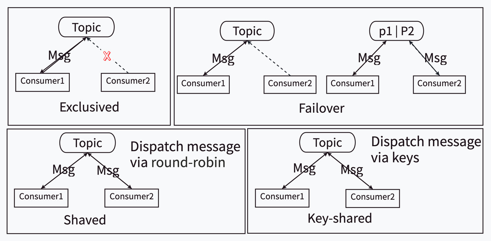
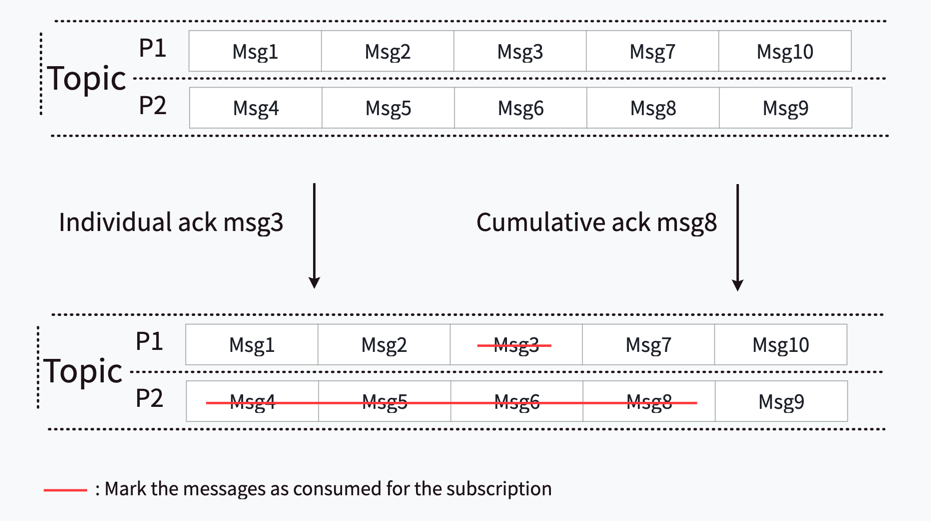
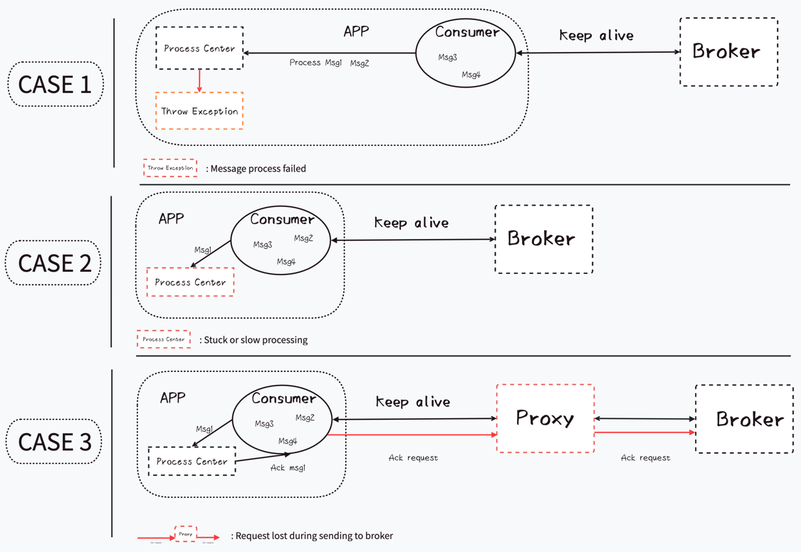
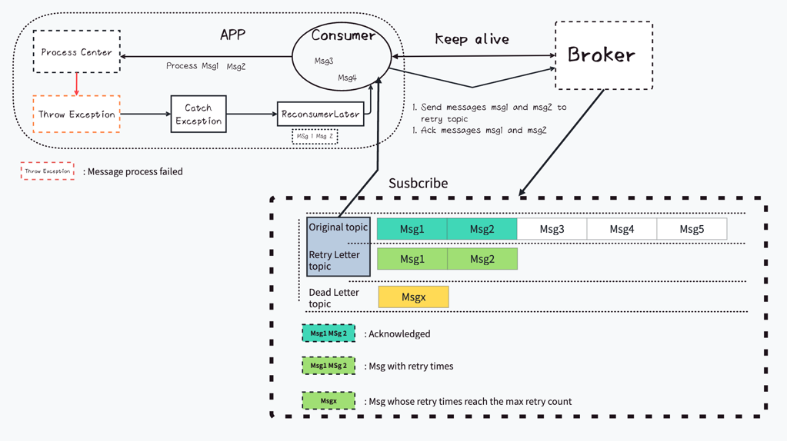
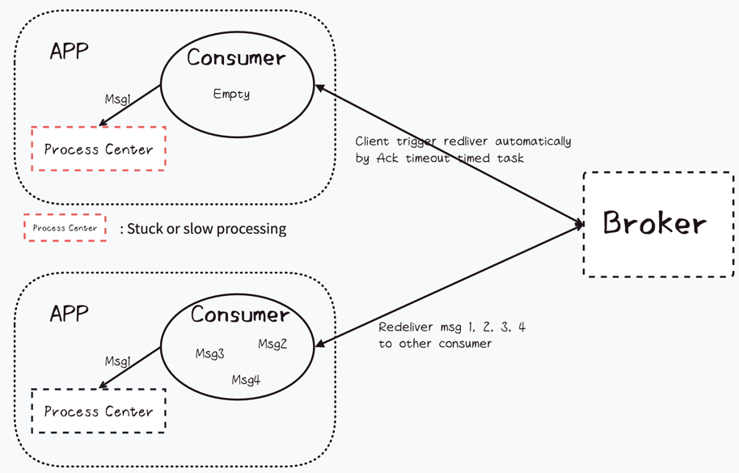
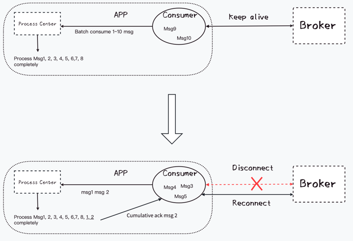

# Consume Best Practice

## Background Knowledge

### Subscription Types

Pulsar is a distributed message system where messages can be sent to topics by producers and consumed by consumers.
Consumers can subscribe to the topics in four ways (subscription types):

* **Exclusive**
* **Failover**
* **Shared**
* **Key-shared**

The messages are consumed in order for a single partition in Exclusive and Failover modes and out of order for Shared and
Key-shared mode. The main difference between Exclusive and Failover is that in Exclusive mode, the consumer is exclusive
to the entire topic, while in Failover mode, the consumer is exclusive to only one partition. Failover mode allows backup
consumer connections that are not consumed. The main difference between Shared and Key-shared is whether their dispatch
strategy is implemented via a key. For more information about subscription type, refer to the [Pulsar website](https://pulsar.apache.org/docs/3.2.x/concepts-messaging/).


### Acknowledgment

The messages should be acknowledged after they are fully consumed and processed, and then the messages would not be received
for the same subscription again. Pulsar provides two ways to acknowledge messages:

* **Cumulative acknowledgment**
* **Individual acknowledgment**

Cumulative acknowledgment receives a message or a message id as a parameter and marks the messages before the message as
consumed for this subscription. For multiple-partition topics, the cumulative acknowledgment will work for the single
partition without impacting other partitions. Individual acknowledgment receives a message or a message id as a parameter
and only marks this message as consumed for this subscription.


### Messages Redeliver Mechanism

There might be instances where the received messages cannot be processed at this time or some errors happened during processing.
The client needs to redeliver the unacknowledged messages or a particular message after a delay or immediately.
Pulsar provides at-least-once semantics when the client does not enable transaction because the client may cache some
messages out of Pulsar when redelivering messages.

Pulsar Consumer API provides four ways to reconsume the unacknowledged messages later:

* **ackTimeout**
* **deadLetterPolicy**
  * **reconsumeLaterCumulative**
  * **reconsumeLater**
* **negativeAcknowledge**
* **redeliverUnacknowledgedMessages**

The **ackTimeout** is an automatic protection mechanism. If a consumer configured ackTimeout, the messages will be
auto-redelivered when the received messages are not acknowledged after a long time. It works at the client side, ensuring
the unacknowledged messages will be redelivered to another consumer when the connection of a consumer remains active
but the business system gets stuck or misses to ack some messages. If the consumer gets disconnected when the client crashes,
the messages will be auto-redelivered by the broker too. However, this mechanism does not wait for the response of acknowledgment,
so if an acknowledgment fails on the broker side or proxy side, an ack hole may occur.

The **deadLetterPolicy** is a policy in the message queue used to handle messages that cannot be processed properly.
In many message queue systems (such as RabbitMQ, Google Pub/Sub, Apache Pulsar, etc.), this strategy is implemented.
In Pulsar, the deadLetterPolicy is implemented at the client side, it creates a new retry letter topic and dead letter
topic when building a consumer with `deadLetterPolicy` configuration. When a consumer calls `reconsumeLaterCumulative`
or `reconsumeLater`, the message (method parameter) will be produced to the retry letter topic until the retry time reaches
the `maxRedeliverCount`. The message will be produced to the dead letter topic when the retry time reaches the `
maxRedeliverCount`. The main difference between them is that `reconsumeLaterCumulative` will cumulative ack the
message (method parameter) after it is produced and `reconsumeLater` will individual ack the message (method parameter)
after it is produced.

The `negativeAcknowledge` is used to redeliver certain unacknowledged messages while `redeliverUnacknowledgedMessages`
is used to redeliver all the unacknowledged messages received by this consumer. The main difference between them and
deadLetterPolicy is that there is no new topic created, and there is an unlimited number of redeliveries.

## Best Practice Suggestion

Different scenarios require different best practices. Users who value the order of partition messages and wish to batch
process data should choose or implement an appropriate routerPolicy to send a batch of ordered messages to the same
partition. They should also select either Exclusive or Failover subscription modes. For users who do not care about
message order and those in stream processing scenarios, they can opt to use Shared and Key-shared subscription modes.

### Shared && Key-shared
#### At-least-once
The term `At least once` ensures that the message is processed at least once, and there is a risk of duplicate messages,
but the performance is better than the `Exactly once` semantics. For the `At least once` semantics in shared or
key-shared mode, the most important matter is avoiding ack-hole as much as possible. The ack-hole refers to instances
where some single messages are missed for acknowledgment. This can occur in the following cases (All of these are the cases
where the connection is not interrupted, and reconnection will automatically resend the message.):

1. Consumer receives messages but fails to process due to business system error.
2. Consumer receives messages but misses to process or the business system gets stuck.
3. Consumer acknowledges the message, but the acknowledge request is lost when sending to the broker. The possibility of
4. data loss exists in the case of TCP long connections, although the probability is extremely low.
   

For case 1, configuring `deadLetterPolicy` is a good solution. When the business system receives a signal of message
processing failure, it can immediately check and decide whether to retry after a period of time. After they call
`reconsumeLater` API, the message will be acknowledged and resent to the retry letter topic that is automatically
subscribed by the consumer. When it reaches `maxRedeliverCount`, the message will be sent to the dead letter topic.
Messages sent to the dead letter topic should be considered as non-retryable messages, and we recommend setting an
initialSubscriptionName to avoid being deleted by the retention policy and then, let maintenance personnel regularly
handle non-retryable messages in the dead letter topic.

```java
        Consumer<Integer> consumer = pulsarClient.newConsumer(Schema.INT32)
        .deadLetterPolicy(DeadLetterPolicy.builder()
                .maxRedeliverCount(maxRedeliverCount)
                .deadLetterTopic(deadLetterTopic)
                .retryLetterTopic(retryLetterTopic)
                .initialSubscriptionName(initialSubscriptionName)
                .build())
        .subscriptionType(SubscriptionType.Shared)
        .enableRetry(true)
        .subscriptionInitialPosition(SubscriptionInitialPosition.Earliest)
        .topic(topic)
        .subscriptionName(sub)
        .subscribe();
Message<Integer> message = consumer.receive();
        try{
            // Process message
            consumer.acknowledge(message);
        }catch(Exception e){
            // Check whether to redeliver the message again.
            if(e instanceof RetryException){
                consumer.reconsumeLater(message, delay, timeunit);
            }
            consumer.reconsumeLater(message, delay, timeunit);
        }
```

For case 2, where the business system gets stuck or an error occurs which causes the received message to be missed for
processing, configuring ack timeout is a good solution. The consumer will record every message received on the client side.
If these messages have not been acknowledged after the specified time, the consumer will request the broker to resend these
messages to other brokers.
**Suggestion:** The ack timeout should be set slightly longer based on the message processing speed of the business system.
If the business system is still processing messages, but the processing time is too long or the timeout is set too small,
it may result in duplicate message consumption.

```java
        Consumer<Integer> consumer = pulsarClient.newConsumer(Schema.INT32)
        .ackTimeout(tiemout, timeunit)
        .subscriptionType(SubscriptionType.Shared)
        .subscriptionInitialPosition(SubscriptionInitialPosition.Earliest)
        .topic(topic)
        .subscriptionName(sub)
        .subscribe();
```

For case 3, there are no effective preventive measures. This is because all methods of redelivery are triggered by the
client when the connection is not disconnected, and the client does not wait for an ack response by default.

`Short-term solution`: This should be an extreme case where users can unload the topic to resolve after observing
an abnormal ack hole (existing for more than 3 * ack time out).
`Long-term solution`: Modify the ack-timeout mechanism to wait for the acknowledgment response.

#### Exactly-once
If the users cannot tolerate message repetition, they can acknowledge messages with a transaction. Transaction can
prevent repeated consumption. If a message has been acknowledged, it will wait for a response and throw
`TransactionConflictException` when the client acknowledges the message with a transaction.

**Notices:** When using transactions, do not configure DeadLetterPolicy, but instead use negativeAcknowledge to resend messages.

```java
        Consumer<Integer> consumer = pulsarClient.newConsumer(Schema.INT32)
                .ackTimeout(tiemout, timeunit)
                .subscriptionType(SubscriptionType.Shared)
                .subscriptionInitialPosition(SubscriptionInitialPosition.Earliest)
                .topic(topic)
                .subscriptionName(sub)
                .subscribe();
        Transaction transaction = pulsarClient.newTransaction().withTransactionTimeout(timeout, timeunit).build().get();

        Message<Integer> message = consumer.receive();
        try {
            // process message
            consumer.acknowledgeAsync(message.getMessageId(), transaction);
            transaction.commit().get();
        } catch (Exception e) {
            if (!(e.getCause() instanceof PulsarClientException.TransactionConflictException)) {
                consumer.negativeAcknowledge(message);
            }
            transaction.abort().get();
        } finally {
            message.release();
        }
```
### Exclusive && Failover
#### At-least-once
For `Exclusive` and `Failover` modes, which follow `At least once` semantics, it's crucial to focus on maintaining
the order of messages while ensuring none are lost. Users are recommended to use cumulative acknowledgment in the
`Exclusive` or `Failover` mode. Pulsar guarantees that the user has received all messages prior to a message that will
be cumulative acknowledged. In this mode, there will be no ack-hole and there is no need to redeliver a specific message.
It is also not recommended to redeliver a specific message as it can cause messages to be out of order. When there is a
problem with the processing of a batch of messages, it is recommended to use `redeliverUnacknowledgedMessages` to
redeliver all unprocessed messages to ensure the orderliness of the messages.
````java
        Consumer<Integer> consumer = pulsarClient.newConsumer(Schema.INT32)
                .subscriptionType(SubscriptionType.Exclusive)
                .subscriptionInitialPosition(SubscriptionInitialPosition.Earliest)
                .subscriptionName(sub)
                .subscribe();
        Message<Integer> message = consumer.receive();
        try {
            // process message
            message = consumer.receive();
            // process message
            // ......
            consumer.acknowledgeCumulative(message);
        } catch (Exception e) {
            consumer.redeliverUnacknowledgedMessages();
        } finally {
            message.release();
        }
````

#### Exactly-once (Beta)
In the `Exclusive` and `Failover` mode, the most troublesome issue for users is the problem of duplicate messages caused
by disconnection. When a connection is reset, the broker will resend all the unacknowledged messages to the consumer.
The consumer may have processed many messages without acknowledging them, causing the consumer to unconsciously resume
these messages repeatedly. Unfortunately, there is currently no effective way to prevent this situation from happening.
Pulsar transaction is not yet sufficient to solve this problem.


`Long-term solution`: Apply epoch to avoid receiving repeated messages and abort transaction in the extreme case
(consumer change frequently in the failover subscription type).

In conclusion, ensuring the reliable transmission of messages in Pulsar involves understanding the different subscription
types, acknowledgment methods, and message redelivery mechanisms. Different scenarios require different best practices,
and users should consider factors such as the order of partition messages, the possibility of duplicate messages,
and the speed of the business system. The solutions provided here, including configuring `deadLetterPolicy` and `ackTimeout`
, using transactions, and modifying the ack-timeout mechanism, can help users to address common issues and optimize their use of Pulsar.
