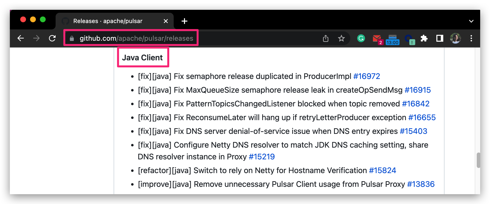

This guide explains everything about Pulsar release notes.

## Intro to release notes

This chapter gives an overview of Pulsar release notes.

### Basic info

[Pulsar release notes](/release-notes/) consist of the following parts.

| Release note                                        | Component                                                                                                |
| --------------------------------------------------- | -------------------------------------------------------------------------------------------------------- |
| [Pulsar Core](/release-notes/#pulsar-release-notes) | <div align="center">Pulsar</div>                                                                         |
| [Pulsar Clients](/docs/client-libraries.md)         | <ul><li>Java</li><li>WebSocket</li><li>C++</li><li>Python</li><li>Go</li><li>NodeJs</li><li>C#</li></ul> |

### Maintenance info

To generate release note page, you're suggested to install the [GitHub CLI](https://cli.github.com/) and authenticate first.

1. Fetch the release metadata:

```bash
# Replace v2.10.2 with the target version tag
gh release view "v2.10.2" -R apache/pulsar --json author,tagName,publishedAt
```

2. Fetch the release notes:

```bash
# Replace v2.10.2 with the target version tag
gh release view "v2.10.2" -R apache/pulsar --json body --jq .body
```

3. Select the related release notes entries and add a [versioned release note](https://github.com/apache/pulsar-site/tree/main/site2/website-next/release-notes/versioned).
4. Update the metadata file [site2/website-next/data/release-*.js](https://github.com/apache/pulsar-site/tree/main/site2/website-next/data).

The process is similar to update standalone client releases.

## Submit release notes

Follow the steps below to submit release notes for Pulsar and clients (**Java and WebSocket**).

:::note

For **C++, Python, Go, Node.js, and C#**, you do not need to take care of them since their release notes are synced from their repos to the [Pulsar Release Note page](https://pulsar.apache.org/release-notes).

:::

1. Submit a PR to add **separate** release notes for Pulsar and clients (**Java and WebSocket**) to [pulsar-site/site2/website-next/release-notes/versioned/](https://github.com/apache/pulsar-site/tree/main/site2/website-next/release-notes/versioned).
2. Get this PR reviewed and merged.
3. Copy the release note to the [Pulsar Releases Page - GitHub](https://github.com/apache/pulsar/releases).

    | Component                             | Step                                                                       |
    | ------------------------------------- | -------------------------------------------------------------------------- |
    | Pulsar Core                           | Copy the release note content.                                             |
    | Pulsar Clients (Java, WebSocket, ...) | Create independent sections for each client and copy release note content. |

    Examples for Java clent's release note:

    

    After the new release is published, all the information about the release is automatically added to the [Pulsar Release Note page](https://pulsar.apache.org/release-notes/).

4. Check whether the release information is shown on the [Pulsar Release Note page](https://pulsar.apache.org/release-notes/) after the website is updated and built successfully.
